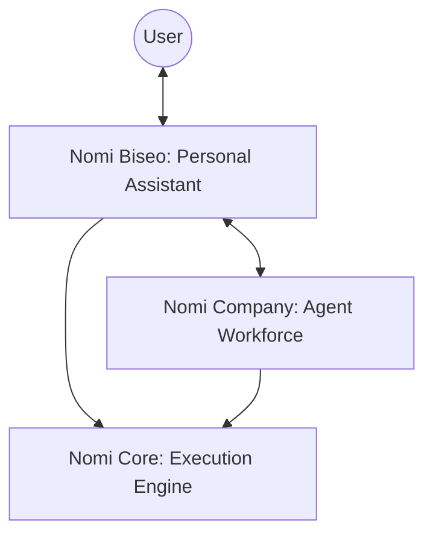

# 🌌 Nomi AI System

> **Personal AI Ecosystem:** An intelligent assistant that deeply understands you and orchestrates a specialized AI workforce.

> ⚠️ This repository is a **public snapshot for demonstration purposes only**.
> The full system is actively developed in private repositories.

---

## 🏗️ System Architecture

Nomi is designed as a layered system that separates interaction, orchestration, and execution.

| Layer      | Component        | Description                                                      |
| ---------- | ---------------- | ---------------------------------------------------------------- |
| **Top**    | **Nomi Company** | The **Workforce**. Specialized agents executing tasks.           |
| **Middle** | **Nomi Biseo**   | The **Chief of Staff**. Your single point of contact.            |
| **Bottom** | **Nomi Core**    | The **Engine**. Infrastructure, LLM abstraction, and validation. |

---

## 📦 Repository Mapping

This showcase aggregates the system into modular packages:

| Package       | Role                                          |
| ------------- | --------------------------------------------- |
| `nomi-core`   | Execution engine, LLM abstraction, validation |
| `nomi-biseo`  | Personal assistant logic and orchestration    |
| `nomi-shared` | Shared utilities, types, and helpers          |
| `nomi-logger` | Logging, tracing, and observability           |

---

## 🧩 Core Components

### 🧠 Nomi Biseo (Personal Assistant)

Biseo is the central intelligence layer and the only interface the user interacts with.

- **Deep Memory:** Learns and evolves with long-term usage
- **Proactive:** Surfaces insights, summaries, and recommendations
- **Orchestrator:** Delegates tasks to specialized agents

---

### 💼 Nomi Company (Agent Workforce)

A collection of stateless, specialized agents that execute tasks.

- **Research Agent:** Web research & summarization
- **News Agent:** Trend detection & briefings
- **Data/Email Agents:** Processing structured and unstructured data
- **Writer/Coding Agents:** Content and code generation

---

### ⚙️ Nomi Core (Execution Engine)

The infrastructure layer responsible for reliability and execution.

- **LLM Abstraction:** Supports multiple providers
- **Execution Control:** Task routing and orchestration
- **Validation Layer:** Structured output + retry handling
- **Cost Tracking:** Observability for AI usage

---

## 💾 Memory Model

Biseo’s personalization is powered by a multi-layer memory system:

1. **👤 Profile** — Static user information
2. **🎯 Goals** — Short and long-term objectives
3. **🔄 Habits** — Recurring behavioral patterns
4. **📜 History** — Context from previous interactions

---

## 🛠️ Capabilities & Tooling

Agents operate through a capability-based execution model:

> **Goal → Capability → Agent**

| Tool               | Function                          |
| ------------------ | --------------------------------- |
| 🌐 Web Search      | Real-time information retrieval   |
| 📧 Email API       | Reading, drafting, classification |
| 📅 Calendar        | Scheduling and reminders          |
| 📊 Database        | Persistent storage and queries    |
| 📁 File Processing | Document parsing and generation   |

---

## 🚀 Workflow Execution

User requests are classified into three categories:

- 💬 **Chat** — Conversational interaction with memory
- ⚡ **Simple Task** — Direct tool or agent execution
- 📝 **Workflow** — Multi-step orchestration

### 6-Step Execution Model

1. **Understand** — Interpret goal using memory
2. **Decompose** — Break into subtasks
3. **Assign** — Match tasks to agents
4. **Execute** — Run via Core engine
5. **Aggregate** — Validate and combine results
6. **Deliver** — Return a coherent response

---

## 🛡️ Design Principles

- **One Interface:** Only Biseo interacts with the user
- **Memory-First:** Personalization is foundational
- **Resilient:** Built-in retry and fallback strategies
- **Provider-Agnostic:** Not tied to a single LLM

---

## 🧪 Engineering Highlights

- Modular architecture with clear separation of concerns
- LLM-agnostic design for flexibility and scalability
- Capability-based task execution model
- Structured output validation and retry mechanisms
- Memory-driven personalization system

---

## 👥 System Roles

- **Biseo:** Chief of Staff — context-aware, decision-making layer
- **Agents:** Specialized workers — focused and stateless
- **Core Engine:** Execution backbone — reliable and scalable

---

## 📌 Notes

This repository represents a **snapshot of the system design and structure** intended for demonstration and portfolio purposes.

---
